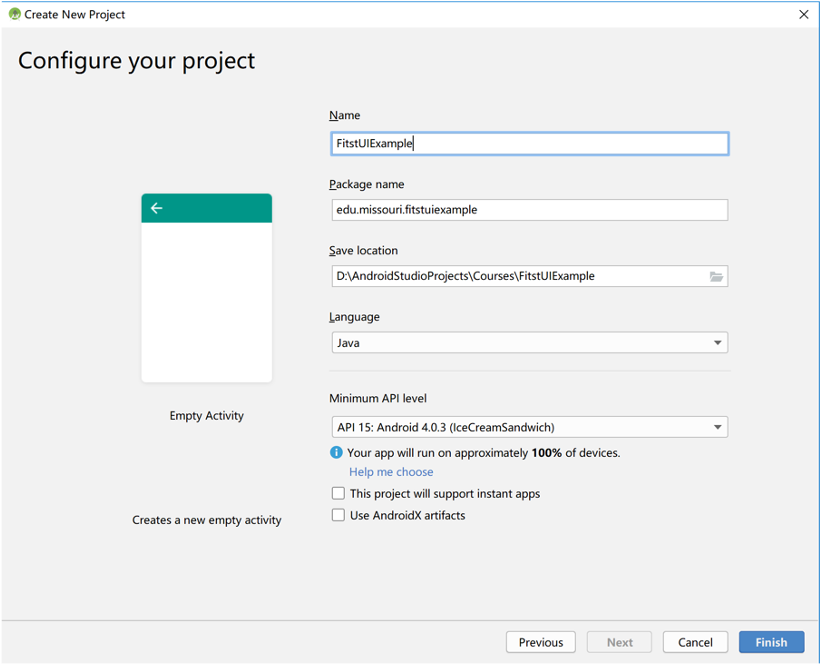

## First UI Example

1.  Open Android Studio, create a new Project with Empty Activity, and name FirstUIExample.

   

   

   

2. Open activity_main.xml file, delete Hello World TextView by selecting it and hit delete button.

   

   

3. Drag a EditText, a Button, a TextView From Palette onto the Design View. The EditText can be found at Palette->Text->Plain Text. Click on Infer Constrains then it will show like the following.

   

   

4. Select Edit Text, change ID to name_et, change hint to "Please Enter You name", and delete the word in the text.

   

   

5. Select Button, change ID to name_btn, and change text to Click Me!

   

   

6. Select TextView, change ID to result_tv, and delete the word in text. 

   

   

7. Go back to MainActivity.java, and add the following fields to the class. You may need to import the class. Typically it will be done by the auto complete, but if is not, you can achieve this by click ALT + ENTER. 

   

   

8. Add the following code in onCreate Method after the existing code. 

   

   

9. Run the App, by clicking the Run button. And launch the simulator. Enter your name like "Mike", and click on the button. The result will show below. 

   

